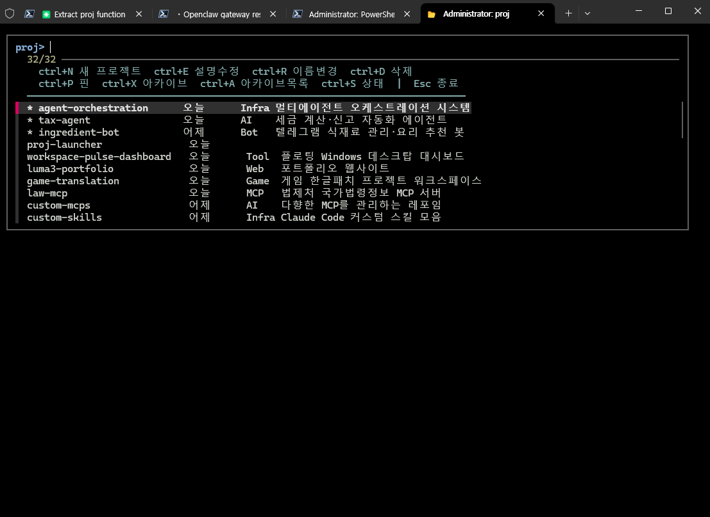
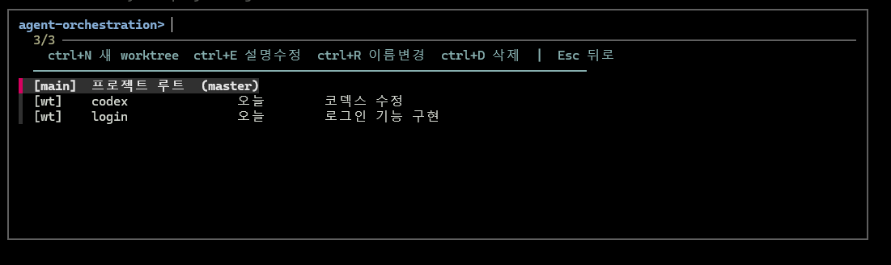
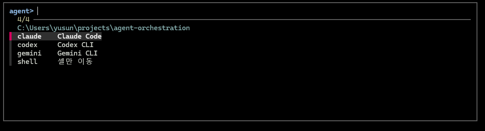
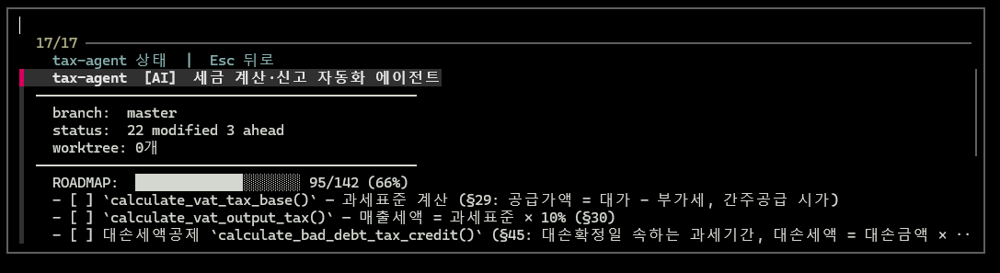

# proj

**fzf 기반 프로젝트 런처** -- 터미널에서 프로젝트를 선택하고, worktree를 관리하고, AI 에이전트를 바로 실행합니다.

`~/projects/` 아래 폴더들을 최근 사용순으로 정렬하여 fzf 메뉴로 보여주고, 선택한 프로젝트에서 Claude Code / Codex / Gemini CLI를 바로 실행할 수 있습니다.



## 주요 기능

| 기능 | 설명 |
|------|------|
| 프로젝트 선택 | `~/projects/` 하위 폴더를 최근 사용순 정렬, fzf로 선택 |
| 에이전트 실행 | Claude Code, Codex CLI, Gemini CLI 중 택1 실행 |
| Worktree 관리 | 프로젝트 내 git worktree 생성/이름변경/삭제 |
| 프로젝트 관리 | 새 프로젝트 생성, 이름변경, 삭제, 설명/카테고리 편집 |
| Pin & Archive | 자주 쓰는 프로젝트 상단 고정, 안 쓰는 프로젝트 아카이브 |
| 프로젝트 상태 | git 브랜치, 변경 파일 수, worktree 수, ROADMAP 진행률 |
| Esc 뒤로가기 | 에이전트 → worktree → 프로젝트 → 종료, 단계별 뒤로 |

## 단축키

### 프로젝트 목록

| 키 | 동작 |
|----|------|
| `Enter` | 프로젝트 선택 (worktree 화면으로) |
| `ctrl+N` | 새 프로젝트 생성 (git init + CLAUDE.md + .gitignore) |
| `ctrl+E` | 설명/카테고리 편집 |
| `ctrl+R` | 이름 변경 |
| `ctrl+D` | 삭제 |
| `ctrl+P` | 핀 고정/해제 |
| `ctrl+X` | 아카이브에 넣기 |
| `ctrl+A` | 아카이브 목록 보기 |
| `ctrl+S` | 프로젝트 상태 보기 |
| `Esc` | 종료 |

### Worktree 목록



| 키 | 동작 |
|----|------|
| `Enter` | worktree 선택 → 에이전트 메뉴 |
| `ctrl+N` | 새 worktree 생성 |
| `ctrl+E` | 설명 편집 |
| `ctrl+R` | 이름 변경 |
| `ctrl+D` | 삭제 |
| `Esc` | 프로젝트 목록으로 |

### 에이전트 메뉴



### 프로젝트 상태 (ctrl+S)



## 설치

### 요구사항

- [git](https://git-scm.com/)
- [fzf](https://github.com/junegunn/fzf)
- [jq](https://jqlang.github.io/jq/)
- (선택) [Claude Code](https://docs.anthropic.com/en/docs/claude-code), [Codex CLI](https://github.com/openai/codex), [Gemini CLI](https://github.com/google-gemini/gemini-cli) 중 하나 이상

### macOS / Linux

```bash
git clone https://github.com/lumatic2/proj-launcher.git ~/projects/proj-launcher
cd ~/projects/proj-launcher
bash setup.sh
```

setup.sh가 자동으로:
1. fzf, jq, git 설치 여부 확인
2. `~/.zshrc` (또는 `~/.bashrc`)에 `source` 라인 추가
3. `~/projects/` 디렉토리 생성 (없으면)

### Windows (PowerShell)

```powershell
git clone https://github.com/lumatic2/proj-launcher.git ~/projects/proj-launcher
cd ~/projects/proj-launcher
powershell -ExecutionPolicy Bypass -File setup.ps1
```

setup.ps1이 자동으로:
1. fzf, jq, git 설치 여부 확인
2. PowerShell `$PROFILE`에 dot-source 라인 추가
3. Windows Terminal 프로필 추가 안내

### 수동 설치

쉘 프로필에 아래 한 줄만 추가하면 됩니다:

```bash
# zsh / bash
source ~/projects/proj-launcher/proj.zsh
```

```powershell
# PowerShell
. ~/projects/proj-launcher/proj.ps1
```

## 사용법

```bash
proj
```

새 터미널을 열고 `proj`를 입력하면 프로젝트 런처가 시작됩니다.

### 프로젝트 메타데이터

프로젝트 설명, 카테고리, 핀/아카이브 상태는 `~/projects/.proj-meta.json`에 저장됩니다. 이 파일은 자동으로 관리되며 직접 편집할 필요가 없습니다.

### PROJECTS_ROOT 커스텀

기본값은 `~/projects/`입니다. 다른 경로를 사용하려면 환경 변수를 설정하세요:

```bash
export PROJECTS_ROOT="$HOME/dev"  # .zshrc에 추가
```

## 구조

```
proj-launcher/
├── proj.zsh       # macOS / Linux (zsh/bash)
├── proj.ps1       # Windows (PowerShell)
├── setup.sh       # macOS / Linux 설치 스크립트
├── setup.ps1      # Windows 설치 스크립트
└── README.md
```

## 라이선스

MIT
